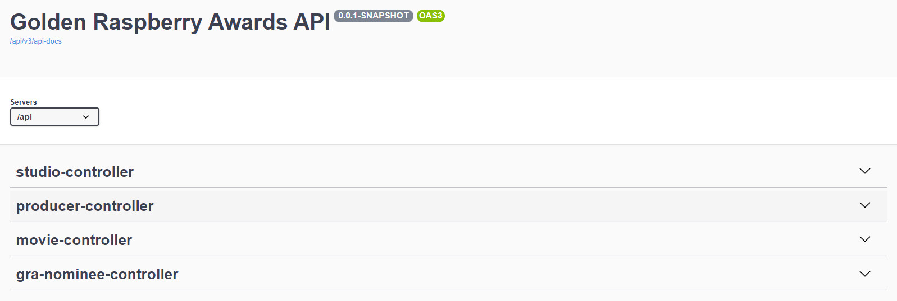
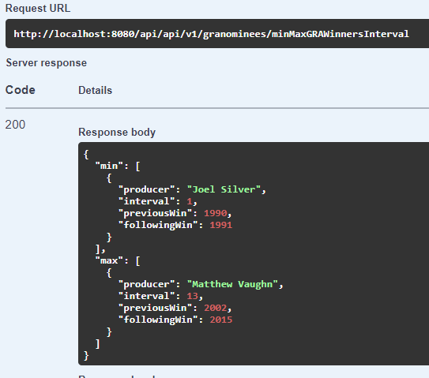
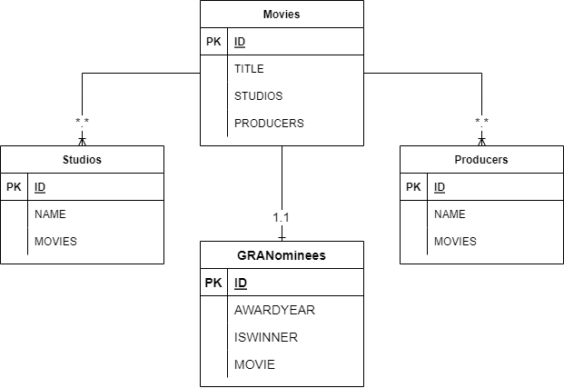

# Golden Raspberry Awards API

- API RESTful que possibilita a leitura da lista de indicados e vencedores
da categoria Pior Filme do Golden Raspberry Awards.

## Stack:
- Java 17
- Spring Boot 2.7.5
- Spring Boot DevTools
- Spring Web
- Spring Data JPA
- H2 Database
- Lombok
- Springdoc OpenAPI UI
- Mapstruct
- Org Apache Commons CSV
- Log4J

## Executar projeto:
```console
mvn spring-boot:run
``` 
# Execução de Teste
```console
mvn test
``` 

## Funcionallidades:
- Importação de dados através de arquivo CSV para a H2 Database.
- API Rest para as entidades Studios, Producers, Movies e GRANominees.
- Testes de integração.
- Link API: http://localhost:8080/api/v1/swagger-ui/index.html
- 

- Obter o produtor com maior intervalo entre dois prêmios consecutivos, e o que obteve dois prêmios mais rápido.
- Link Endpoint: http://localhost:8080/api/v1/granominees/minMaxGRAWinnersInterval
- 

## Diagrama ER:
- 

## H2 Database:
- URL: jdbc:h2:mem:testdb   
- Username: sa
- Password: sa
- Endpoint: http://localhost:8080/api/v1/h2

